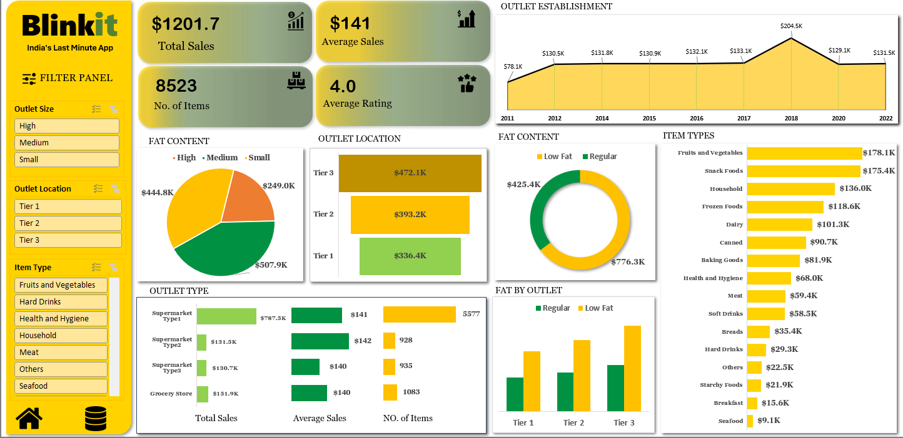

# ⚡ Blinkit Sales Performance & Product Distribution Analysis Dashboard

## 💡 Project Overview

This repository hosts the **Blinkit Sales & Product Distribution Analysis Dashboard**, an interactive analytical tool built in Excel. The dashboard provides a **quick overview** of Blinkit's sales performance and product distribution, highlighting key metrics and visual trends.

It offers a clean and interactive way for stakeholders to analyze business performance at a glance through a dynamic filter panel, allowing users to easily segment data for deeper insights.

---

## 🔑 Key Performance Indicators (KPIs)

The dashboard prominently features the following four core metrics:

| No. | KPI Name | Objective |
| :---: | :--- | :--- |
| **1** | **Total Sales** | The overall revenue generated from all items sold. |
| **2** | **Average Sales** | The average revenue per sale. |
| **3** | **Number of Items** | The total count of different items sold. |
| **4** | **Average Rating** | The average customer rating for items sold. |

---

## 📈 Dashboard Visualizations (Chart Requirements)

The following charts are used to visualize the data and address specific business objectives:

### 📊 Sales Composition Charts

| No. | Chart Name | Objective | Chart Type |
| :---: | :--- | :--- | :--- |
| **1** | Total Sales by Fat Content | Analyze the impact of fat content on total sales. | **Donut Chart** |
| **2** | Total Sales by Item Type | Identify the performance of different item types in terms of total sales. | **Bar Chart** |

### 🏘️ Outlet and Location Performance Charts

| No. | Chart Name | Objective | Chart Type |
| :---: | :--- | :--- | :--- |
| **3** | Fat Content by Outlet for Total Sales | Compare total sales across different outlets segmented by fat content. | **Stacked Column Chart** |
| **4** | Total Sales by Outlet Establishment | Evaluate how the age or type of outlet establishment influences total sales. | **Line Chart** |
| **5** | Sales by Outlet Size | Analyze the correlation between outlet size and total sales. | **Pie Chart** |
| **6** | Sales by Outlet Location | Assess the geographic distribution of sales across different locations. | **Funnel Map** |

### 📋 Comprehensive Metric View

| No. | Chart Name | Objective | Chart Type |
| :---: | :--- | :--- | :--- |
| **7** | All Metrics by Outlet Type | Provide a comprehensive view of all key metrics (Total Sales, Average Sales, Number of Items, Average Rating) broken down by different outlet types. | **Matrix Card** |

---

## 🛠️ Data Source & Technology

* **Primary Tool:** Microsoft Excel
* **Data Source:** Blinkit Raw Sales Data (typically a CSV or internal database export)
* **Key Dashboard Feature:** Interactive Filter Panel for data segmentation.

---

## 👩‍💻 About Me

📊 I am a beginner data analyst who recently finished a Data Analysis course. This Blinkit Sales Analysis project is my first practical Excel project, created to strengthen my analytical and visualization skills.
